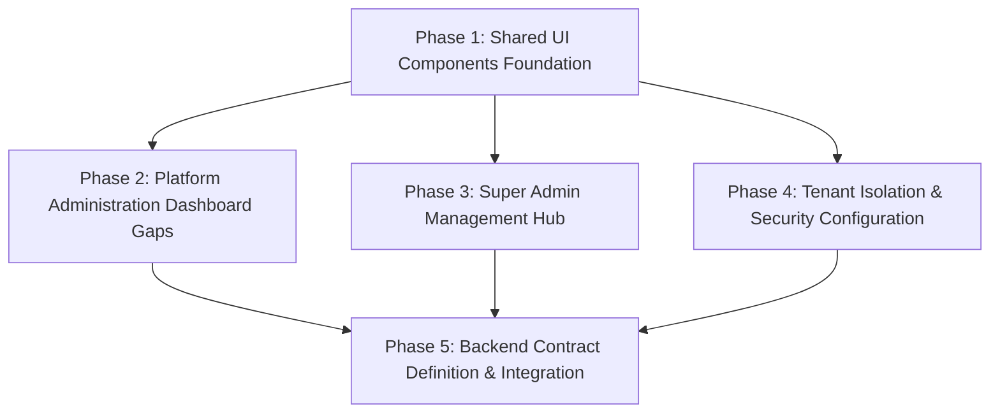

# Super Admin Reference Project — Implementation Backlog

## 1. Objective

This implementation backlog converts the completed **58-Story Wireframe → Super Admin Reference Project Gap Matrix** ([WIREframe_REFERENCE_GAP_MATRIX.md](file:///D:/super-admin-reference/docs/wireframes/WIREframe_REFERENCE_GAP_MATRIX.md)) into an actionable, dependency-sequenced engineering plan.

The Super Admin Reference Project serves as the authoritative visual, structural, and interaction reference prototype. In accordance with project governance rules:
- **UI Implementation Gaps are strictly separated from Backend/API Dependencies.**
- **No backend APIs or database schemas are invented or assumed.**
- **Existing visually complete UI screens (55 stories) remain untouched and are not slated for redevelopment.**
- **Only genuine UI gaps (3 stories, broken down into 6 actionable tasks) are scheduled for development.**
- **All backend capabilities required by the wireframe are formally cataloged for future handoff to the backend engineering team.**

## 2. Current Baseline

The baseline established by the 58-story gap matrix audit reveals the following status distribution:

| Dimension | Status / Metric | Details |
| :--- | :--- | :--- |
| **Total Stories Audited** | **58 Stories** | 100% of wireframe stories from official 218-page specification |
| **UI Implementation Coverage** | **55 Fully Implemented (94.8%)** | Complete visual layouts, data tables, filter toolbars, modal workflows, action dropdowns |
| **UI Implementation Gaps** | **3 Partially Implemented (5.2%)** | Story-1 (Platform Admin), Story-1.1 (Super Admin Mgmt), Story-1.2.5 (Tenant Isolation) |
| **UI Missing Stories** | **0 Missing (0.0%)** | Zero completely missing screens or navigation groups |
| **Backend / API Layer State** | **100% Mock / Static Data** | All 58 screens operate on client-side React state and mock datasets in `src/mock/index.ts` |
| **Live API Integration** | **0% Live Integration** | No live REST/GraphQL network endpoints or external database connections exist |
| **Overall Story Status** | **58 Partially Implemented** | Full visual coverage backed by client prototype mock data |

## 3. UI Implementation Backlog

This section lists **only genuine UI/functional presentation gaps** identified in the reference project. All tasks are set to `NOT STARTED` awaiting formal review.

| ID | Story | Feature | Current State | Required Change | Files Affected | Backend Dependency | Dependency | Status |
| :--- | :--- | :--- | :--- | :--- | :--- | :--- | :--- | :--- |
| UI-001 | Story-1 | Real-Time Hardware Resource Utilization Meters | SuperAdminDashboard.tsx displays high-level stat cards (Users, Orgs, Revenue, etc.) and health badges, but lacks CPU core and memory utilization visual percentage gauges. | Add visual CPU and Memory percentage utilization gauges with color thresholds (green < 60%, yellow 60-80%, red > 80%) to the console system health panel. | `src/pages/platform/SuperAdminDashboard.tsx` | Telemetry / Metrics Stream (Simulated via mock state in UI prototype) | Shared component: TelemetryGauge | **COMPLETED** |
| UI-002 | Story-1 | Active Online User Sessions Indicator Widget | Summary metrics display total registered users and active users, but omit a dedicated live online session counter widget. | Add an active online session counter widget with real-time pulse indicator to the dashboard summary stats grid. | `src/pages/platform/SuperAdminDashboard.tsx` | Session count telemetry (Simulated in mock state) | None | **COMPLETED** |
| UI-003 | Story-1 | Unified Export Dashboard Report Action Dialog | Dashboard header has a generic Export button triggering an alert toast, without format selection or scope customization. | Add an export modal dialog allowing export format selection (PDF Executive Summary, CSV Metrics Dump, Excel Operational Report) with simulated download trigger. | `src/pages/platform/SuperAdminDashboard.tsx` | PDF/Excel binary report generation engine (Simulated download in UI) | Shared component: ExportReportModal | **COMPLETED** |
| UI-004 | Story-1.1 | Dedicated Standalone Super Admin Management Hub Screen | Administrative functions are distributed across sidebar navigation items and the platform console; no dedicated standalone administrative hub page exists. | Create dedicated page SuperAdminManagementHub.tsx at route /platform/super-admin featuring administrative user directory, platform role governance overview, module configuration health cards, and direct management action shortcuts. | `src/pages/platform/SuperAdminManagementHub.tsx, src/App.tsx, src/components/layout/Sidebar.tsx` | Platform administrative registry service (Simulated via mock data) | Shared component: ModuleHealthCard | **COMPLETED** |
| UI-005 | Story-1.2.5 | Customer-Managed Key (BYOK) Encryption Configuration Form | TenantDetails.tsx (Database tab) displays static cards showing KMS Key ARN, but provides no interactive input form to configure, validate, or rotate customer keys. | Add BYOK key management form with Key ARN input field, key provider selector (AWS KMS, Azure Key Vault, HashiCorp Vault), key validation state badge, and Key Rotation modal. | `src/pages/tenants/TenantDetails.tsx` | Cloud KMS / Key Management Service (Simulated key validation in UI) | None | **COMPLETED** |
| UI-006 | Story-1.2.5 | CIDR Network Policy & IP Allowlist Management Table | TenantDetails.tsx has database and tenant isolation summary cards, but lacks an interactive IP allowlist / CIDR network policy table. | Add an interactive CIDR Network Allowlist table allowing administrators to add, edit, and remove IP ranges with CIDR format validation and enforcement toggle. | `src/pages/tenants/TenantDetails.tsx` | Network policy enforcement / VPC security group engine (Simulated in mock state) | Shared component: CIDRNetworkTable | **COMPLETED** |

## 4. Backend / API Dependency Backlog

This backlog catalogs the operational capabilities required by the official wireframe that depend on server-side architecture. In accordance with zero-speculation rules, no endpoints, DTOs, or database schemas are invented; capabilities are stated strictly as required by the wireframe specification.

| ID | Story | Capability Required | Why Required | Frontend Dependency | Backend Status | Notes |
| :--- | :--- | :--- | :--- | :--- | :--- | :--- |
| BE-001 | Story-1, Story 1.1.1 | Real-time System Metrics & Telemetry Aggregation | Wireframe requires live monitoring of CPU, memory, server health, API response times, and online user counts on executive dashboards. | `SuperAdminDashboard, GlobalDashboard, MonitoringDashboard` | *Backend contract not yet defined* | Requires streaming telemetry bus or high-frequency polling endpoint. |
| BE-002 | Story-1, Story 1.1.1, Story-1.8.4 | Binary Document Generation & Export Service | Wireframe requires exporting comprehensive PDF, XLSX, and CSV reports for executive summaries, audit histories, and compliance certifications. | `Dashboard Export button, ComplianceReports export action` | *Backend contract not yet defined* | Requires server-side headless rendering or spreadsheet serialization service. |
| BE-003 | Story 1.1.2, Story 1.1.3, Story-1.7, Story-1.7.1 - 1.7.4 | Centralized Platform & System Configuration Persistence | Wireframe requires persisting and dynamically propagating global settings, localization, default currencies, and timezones across all tenant portals. | `PlatformConfiguration, GlobalSettings, SystemConfig views` | *Backend contract not yet defined* | Requires configuration storage with distributed cache invalidation. |
| BE-004 | Story-1.1.4, Story-1.2.3 | Multi-Tenant White-Label Branding Asset & Theme Storage | Wireframe requires storing logos, favicons, custom CSS, and brand hex codes per tenant with CDN distribution. | `PlatformBranding, TenantBranding views` | *Backend contract not yet defined* | Requires object storage integration (S3/GCS) with public CDN distribution. |
| BE-005 | Story-1.1.5 | Software License Lifecycle & Tier Quota Management | Wireframe requires seat allocation enforcement, license tier upgrades, renewal tracking, and feature entitlement gating. | `LicenseManagement view and modal workflows` | *Backend contract not yet defined* | Requires integration with billing/licensing authority and entitlement checks. |
| BE-006 | Story-1.1.6 | Dynamic Feature Flagging & Module Provisioning Service | Wireframe requires granular toggling of platform modules (Core ERP, HRMS, CRM, Finance) per tenant and system-wide. | `FeatureManagement view` | *Backend contract not yet defined* | Requires dynamic feature evaluation service with sub-millisecond evaluation. |
| BE-007 | Story-1.2, Story-1.2.1, Story-1.2.2 | Multi-Tenant Account Lifecycle & Provisioning Engine | Wireframe requires tenant onboarding workflow: account creation, subdomain assignment, status activation/suspension, and quota initialization. | `TenantManagement list, Create Tenant modal, TenantDetails` | *Backend contract not yet defined* | Requires asynchronous tenant provisioning orchestrator. |
| BE-008 | Story-1.2.4 | Multi-Tenant Polyglot Database Provisioning & Schema Isolation | Wireframe specifies dedicated database schema per tenant (PostgreSQL) and logical collection segregation (MongoDB). | `TenantDetails Database tab` | *Backend contract not yet defined* | Requires automated database migration runner and connection pool router. |
| BE-009 | Story-1.2.5 | Tenant Cryptographic Isolation & Network Policy Enforcement | Wireframe requires Customer-Managed Keys (BYOK KMS integration) and CIDR IP boundary enforcement for enterprise tenant isolation. | `TenantDetails Isolation tab (UI-005, UI-006)` | *Backend contract not yet defined* | Requires cloud KMS key binding and ingress API gateway network policy filters. |
| BE-010 | Story-1.2.6 | Tenant Database Backup Snapshot & Disaster Recovery Orchestrator | Wireframe requires on-demand backup triggers, scheduled backup policies, snapshot integrity verification, and point-in-time recovery. | `TenantDetails Backup tab` | *Backend contract not yet defined* | Requires storage snapshot API and restore job runner. |
| BE-011 | Story-1.3, Story-1.3.1 - 1.3.6 | Organizational Hierarchy Graph Persistence | Wireframe requires strict relational hierarchy between companies, business units, departments, branches, cost centers, and office locations. | `OrganizationManagement, CompanySetup, Departments, Branches, Locations` | *Backend contract not yet defined* | Requires relational schema with tree traversal and integrity cascade constraints. |
| BE-012 | Story-1.4, Story-1.4.1, Story-1.4.3 - 1.4.5 | User Directory Lifecycle & Profile Management Service | Wireframe requires user account registration, profile attribute updates, password resets, activation, and deactivation workflows. | `UserManagement table, UserDetails, Create User modal` | *Backend contract not yet defined* | Requires identity store with email verification and welcome invitation triggers. |
| BE-013 | Story-1.4.2, Story-1.4.6 | Asynchronous Bulk User Ingestion & Batch Directory Sync | Wireframe requires uploading CSV user batches, validating schema headers, executing transactional bulk inserts, and returning row error reports. | `UserManagement CSV Bulk Import modal` | *Backend contract not yet defined* | Requires background batch processing worker queue (e.g. Celery / Spring Batch). |
| BE-014 | Story-1.5, Story-1.5.1 - 1.5.3 | Role-Based Access Control (RBAC) Policy & Evaluation Engine | Wireframe requires managing roles, permission entitlement matrices, and runtime authorization enforcement on all API requests. | `RoleManagement, PermissionManagement, AdminAccessMatrix` | *Backend contract not yet defined* | Requires policy decision point (PDP) and policy enforcement point (PEP) interceptors. |
| BE-015 | Story-1.5.4, Story-1.5.5 | Fine-Grained Data Scoping & Departmental Authorization Filtering | Wireframe requires restricting record visibility based on assigned organization, department, and branch boundaries. | `DataPermissions, DepartmentPermissions, ActionBoundaryBar` | *Backend contract not yet defined* | Requires database row-level security (RLS) or query filtering interceptors. |
| BE-016 | Story-1.6, Story-1.6.1 | Secure Credential Authentication & Token Lifecycle Engine | Wireframe requires secure login, cryptographic password verification (Argon2/BCrypt), JWT access/refresh token generation, and renewal. | `LoginPage, AuthContext` | *Backend contract not yet defined* | Requires RFC 7519 JWT implementation with cryptographic signature validation. |
| BE-017 | Story-1.6.2 | Authentication Audit & Login History Ingestion | Wireframe requires recording every login attempt with IP address, device browser fingerprint, geolocation, timestamp, and status. | `LoginHistory view` | *Backend contract not yet defined* | Requires append-only authentication event logger with GeoIP resolution. |
| BE-018 | Story-1.6.3 | Enterprise Single Sign-On (SSO) Federation Service | Wireframe requires SAML 2.0 and OIDC federated login with corporate identity providers (Azure AD, Okta, PingIdentity). | `SSOConfiguration view` | *Backend contract not yet defined* | Requires SAML Service Provider (SP) metadata generation and assertion consumer service. |
| BE-019 | Story-1.6.4 | OAuth 2.0 Authorization Server & Client Governance | Wireframe requires managing registered OAuth2 client applications, client credentials, PKCE flows, and scoped access tokens. | `OAuthConfiguration view` | *Backend contract not yet defined* | Requires OAuth 2.0 / OIDC Authorization Server compliance. |
| BE-020 | Story-1.6.5 | Multi-Factor Authentication (MFA) Verification Engine | Wireframe requires TOTP HMAC secret provisioning, QR code generation, and time-based code verification for step-up security. | `MFAConfiguration view` | *Backend contract not yet defined* | Requires RFC 6238 TOTP implementation with time-drift tolerance. |
| BE-021 | Story-1.6.6 | Password Policy Governance & History Verification | Wireframe requires enforcing password length, complexity regex, expiration schedules, and preventing password reuse against history. | `PasswordPolicy view` | *Backend contract not yet defined* | Requires password policy validation service integrated into credential update endpoints. |
| BE-022 | Story-1.6.7 | Automated Account Lockout & Brute-Force Protection Service | Wireframe requires tracking consecutive failed login attempts, triggering automatic account lockouts, and enforcing lockout duration timers. | `AccountLockout view` | *Backend contract not yet defined* | Requires distributed atomic counters (e.g. Redis) with TTL expiration. |
| BE-023 | Story-1.6.8 | Security Threat Detection & Automated Alerting Engine | Wireframe requires monitoring for suspicious activity (multiple failed logins, impossible travel, privilege escalation) and issuing alerts. | `SecurityAlerts view` | *Backend contract not yet defined* | Requires security event stream analysis and notification webhook dispatch. |
| BE-024 | Story-1.6.9 | Device Fingerprinting, Trust & Remote Wipe Orchestration | Wireframe requires tracking authorized employee devices, managing trust status, and revoking tokens / wiping sessions on lost devices. | `DeviceManagement view` | *Backend contract not yet defined* | Requires device fingerprint matching and session revocation handlers. |
| BE-025 | Story-1.6.10 | Distributed Session Management & Remote Invalidation | Wireframe requires tracking active concurrent user sessions across distributed nodes and supporting administrative session termination. | `SessionManagement view` | *Backend contract not yet defined* | Requires centralized session store (e.g. Redis) and token revocation blacklist. |
| BE-026 | Story-1.7.5 | Outbound Email Dispatch & SMTP Gateway Integration | Wireframe requires configuring corporate SMTP gateways, SSL/TLS handshakes, sending test emails, and rendering transactional templates. | `EmailConfiguration view` | *Backend contract not yet defined* | Requires asynchronous email dispatcher with retry queues and bounce logging. |
| BE-027 | Story-1.7.6 | Outbound SMS Dispatch & Telephony Gateway Integration | Wireframe requires configuring external SMS gateways (Twilio, AWS SNS), sending test SMS, and routing MFA verification codes. | `SMSConfiguration view` | *Backend contract not yet defined* | Requires SMS provider client integration with rate limiting. |
| BE-028 | Story-1.8, Story-1.8.1 - 1.8.3 | Immutable Audit Trail & Security Event Ingestion Bus | Wireframe requires recording all administrative events, user actions, and security changes in an append-only, tamper-evident log. | `AuditDashboard, AuditLogs, ActivityLogs, SecurityLogs` | *Backend contract not yet defined* | Requires append-only event streaming (Kafka/Kinesis) and cryptographic hash chaining. |

## 5. Shared UI / Infrastructure Dependencies

To avoid code duplication and maintain visual consistency across the reference project, the following shared UI components must be created prior to or alongside the specific UI gap implementations:

1. **`TelemetryGauge` / `ResourceUtilizationBar` Component:**
   - **Purpose:** Reusable visual meter displaying percentage utilization (CPU core load, RAM memory usage, storage capacity) with standard enterprise threshold colors (Green < 60%, Amber 60–80%, Red > 80%).
   - **Required By:** UI-001 (Story-1 Platform Administration) and usable in MonitoringDashboard.
   - **Target File:** `src/components/ui/TelemetryGauge.tsx`

2. **`ExportReportModal` Component:**
   - **Purpose:** Standardized modal dialog providing format selection (Executive PDF, Raw CSV Dump, Detailed Excel Workbook), reporting date-range filters, and an asynchronous generation trigger with simulated progress.
   - **Required By:** UI-003 (Story-1 Platform Administration) and reusable across Story-1.8.4 (Compliance Reports) and Story-1.8.1 (Audit Logs).
   - **Target File:** `src/components/ui/ExportReportModal.tsx`

3. **`CIDRNetworkTable` Component:**
   - **Purpose:** Interactive editable table allowing administrators to add, validate, toggle, and delete IPv4/IPv6 CIDR network allowlist ranges with inline validation rules.
   - **Required By:** UI-006 (Story-1.2.5 Tenant Isolation) and reusable in Story-1.6.8 (Security Alerts / IP Boundary controls).
   - **Target File:** `src/components/ui/CIDRNetworkTable.tsx`

4. **`ModuleHealthCard` Component:**
   - **Purpose:** Visual status card displaying the operational state of platform administrative modules (Active, Attention Needed, Unconfigured) with shortcut navigation links and quick-action triggers.
   - **Required By:** UI-004 (Story-1.1 Super Admin Management Hub).
   - **Target File:** `src/components/ui/ModuleHealthCard.tsx`

## 6. Story-by-Story Implementation Status

The following table details the exact implementation state, required UI scope, backend dependency status, and immediate next action for all **58 wireframe stories** without exception:

| Story | Current UI State | UI Work Required | Backend Dependency | Next Action |
| :--- | :--- | :--- | :--- | :--- |
| **Story-1** (Platform Administration) | Partially Implemented | Add consolidated CPU/memory utilization meters, active session counter, and export action | Backend dependency: Required | Implement UI tasks UI-001, UI-002, UI-003 |
| **Story-1.1** (Super Admin Management) | Partially Implemented | Create dedicated standalone Super Admin Management hub screen (/platform/super-admin) | Backend dependency: Required | Implement UI task UI-004 |
| **Story 1.1.1** (Global Dashboard) | Fully Implemented | UI gap: None identified | Backend dependency: Required | Await backend contract definition |
| **Story 1.1.2** (Platform Configuration) | Fully Implemented | UI gap: None identified | Backend dependency: Required | Await backend contract definition |
| **Story 1.1.3** (Global Settings) | Fully Implemented | UI gap: None identified | Backend dependency: Required | Await backend contract definition |
| **Story-1.1.4** (Platform Branding) | Fully Implemented | UI gap: None identified | Backend dependency: Required | Await backend contract definition |
| **Story-1.1.5** (License Management) | Fully Implemented | UI gap: None identified | Backend dependency: Required | Await backend contract definition |
| **Story-1.1.6** (Feature Management) | Fully Implemented | UI gap: None identified | Backend dependency: Required | Await backend contract definition |
| **Story-1.2** (Tenant Management) | Fully Implemented | UI gap: None identified | Backend dependency: Required | Await backend contract definition |
| **Story-1.2.1** (Create Tenant) | Fully Implemented | UI gap: None identified | Backend dependency: Required | Await backend contract definition |
| **Story-1.2.2** (Tenant Configuration) | Fully Implemented | UI gap: None identified | Backend dependency: Required | Await backend contract definition |
| **Story-1.2.3** (Tenant Branding) | Fully Implemented | UI gap: None identified | Backend dependency: Required | Await backend contract definition |
| **Story-1.2.4** (Tenant Database) | Fully Implemented | UI gap: None identified | Backend dependency: Required | Await backend contract definition |
| **Story-1.2.5** (Tenant Isolation) | Partially Implemented | Add customer-managed key (BYOK) form and CIDR network allowlist table | Backend dependency: Required | Implement UI tasks UI-005, UI-006 |
| **Story-1.2.6** (Tenant Backup) | Fully Implemented | UI gap: None identified | Backend dependency: Required | Await backend contract definition |
| **Story-1.3** (Organization Management) | Fully Implemented | UI gap: None identified | Backend dependency: Required | Await backend contract definition |
| **Story-1.3.1** (Company Setup) | Fully Implemented | UI gap: None identified | Backend dependency: Required | Await backend contract definition |
| **Story-1.3.2** (Business Units) | Fully Implemented | UI gap: None identified | Backend dependency: Required | Await backend contract definition |
| **Story-1.3.3** (Departments) | Fully Implemented | UI gap: None identified | Backend dependency: Required | Await backend contract definition |
| **Story-1.3.4** (Branches) | Fully Implemented | UI gap: None identified | Backend dependency: Required | Await backend contract definition |
| **Story-1.3.5** (Cost Centers) | Fully Implemented | UI gap: None identified | Backend dependency: Required | Await backend contract definition |
| **Story-1.3.6** (Locations) | Fully Implemented | UI gap: None identified | Backend dependency: Required | Await backend contract definition |
| **Story-1.4** (User Management) | Fully Implemented | UI gap: None identified | Backend dependency: Required | Await backend contract definition |
| **Story-1.4.1** (User Registration) | Fully Implemented | UI gap: None identified | Backend dependency: Required | Await backend contract definition |
| **Story-1.4.2** (User Import) | Fully Implemented | UI gap: None identified | Backend dependency: Required | Await backend contract definition |
| **Story-1.4.3** (User Profile) | Fully Implemented | UI gap: None identified | Backend dependency: Required | Await backend contract definition |
| **Story-1.4.4** (User Activation) | Fully Implemented | UI gap: None identified | Backend dependency: Required | Await backend contract definition |
| **Story-1.4.5** (User Deactivation) | Fully Implemented | UI gap: None identified | Backend dependency: Required | Await backend contract definition |
| **Story-1.4.6** (Bulk User Upload) | Fully Implemented | UI gap: None identified | Backend dependency: Required | Await backend contract definition |
| **Story-1.5** (Role & Permission Management) | Fully Implemented | UI gap: None identified | Backend dependency: Required | Await backend contract definition |
| **Story-1.5.1** (Roles) | Fully Implemented | UI gap: None identified | Backend dependency: Required | Await backend contract definition |
| **Story-1.5.2** (Permissions) | Fully Implemented | UI gap: None identified | Backend dependency: Required | Await backend contract definition |
| **Story-1.5.3** (RBAC (Role-Based Access Control)) | Fully Implemented | UI gap: None identified | Backend dependency: Required | Await backend contract definition |
| **Story-1.5.4** (Data Permissions) | Fully Implemented | UI gap: None identified | Backend dependency: Required | Await backend contract definition |
| **Story-1.5.5** (Department permissions) | Fully Implemented | UI gap: None identified | Backend dependency: Required | Await backend contract definition |
| **Story-1.6** (Authentication & Security) | Fully Implemented | UI gap: None identified | Backend dependency: Required | Await backend contract definition |
| **Story-1.6.1** (Login) | Fully Implemented | UI gap: None identified | Backend dependency: Required | Await backend contract definition |
| **Story-1.6.2** (Login History) | Fully Implemented | UI gap: None identified | Backend dependency: Required | Await backend contract definition |
| **Story-1.6.3** (SSO (Single Sign-On)) | Fully Implemented | UI gap: None identified | Backend dependency: Required | Await backend contract definition |
| **Story-1.6.4** (OAuth) | Fully Implemented | UI gap: None identified | Backend dependency: Required | Await backend contract definition |
| **Story-1.6.5** (MFA (Multi-Factor Authentication)) | Fully Implemented | UI gap: None identified | Backend dependency: Required | Await backend contract definition |
| **Story-1.6.6** (Password Policy) | Fully Implemented | UI gap: None identified | Backend dependency: Required | Await backend contract definition |
| **Story-1.6.7** (Account Lockout) | Fully Implemented | UI gap: None identified | Backend dependency: Required | Await backend contract definition |
| **Story-1.6.8** (Security Alerts) | Fully Implemented | UI gap: None identified | Backend dependency: Required | Await backend contract definition |
| **Story-1.6.9** (Device Management) | Fully Implemented | UI gap: None identified | Backend dependency: Required | Await backend contract definition |
| **Story-1.6.10** (Session Management) | Fully Implemented | UI gap: None identified | Backend dependency: Required | Await backend contract definition |
| **Story-1.7** (System Configuration) | Fully Implemented | UI gap: None identified | Backend dependency: Required | Await backend contract definition |
| **Story-1.7.1** (General Settings) | Fully Implemented | UI gap: None identified | Backend dependency: Required | Await backend contract definition |
| **Story-1.7.2** (Localization) | Fully Implemented | UI gap: None identified | Backend dependency: Required | Await backend contract definition |
| **Story-1.7.3** (Currency) | Fully Implemented | UI gap: None identified | Backend dependency: Required | Await backend contract definition |
| **Story-1.7.4** (Time Zone) | Fully Implemented | UI gap: None identified | Backend dependency: Required | Await backend contract definition |
| **Story-1.7.5** (Email Configuration) | Fully Implemented | UI gap: None identified | Backend dependency: Required | Await backend contract definition |
| **Story-1.7.6** (SMS Configuration) | Fully Implemented | UI gap: None identified | Backend dependency: Required | Await backend contract definition |
| **Story-1.8** (Audit & Compliance) | Fully Implemented | UI gap: None identified | Backend dependency: Required | Await backend contract definition |
| **Story-1.8.1** (Audit Logs) | Fully Implemented | UI gap: None identified | Backend dependency: Required | Await backend contract definition |
| **Story-1.8.2** (Activity Logs) | Fully Implemented | UI gap: None identified | Backend dependency: Required | Await backend contract definition |
| **Story-1.8.3** (Security Logs) | Fully Implemented | UI gap: None identified | Backend dependency: Required | Await backend contract definition |
| **Story-1.8.4** (Compliance Reports) | Fully Implemented | UI gap: None identified | Backend dependency: Required | Await backend contract definition |

## 7. Dependency-Based Implementation Sequence

The implementation backlog is organized into a strictly **dependency-ordered sequence** based on technical architecture prerequisites:

### Phase 1: Shared UI Infrastructure Components
- **Tasks:** Construct `TelemetryGauge`, `ExportReportModal`, `CIDRNetworkTable`, and `ModuleHealthCard` in `src/components/ui/`.
- **Technical Rationale:** These visual primitives are direct dependencies for the dashboard meters (UI-001), export action (UI-003), management hub (UI-004), and isolation tables (UI-006).

### Phase 2: Platform Administration Dashboard Gaps (Story-1)
- **Tasks:**
  - **UI-001:** Integrate CPU and Memory utilization telemetry gauges into `SuperAdminDashboard.tsx`.
  - **UI-002:** Integrate active online user session counter widget with pulse indicator into `SuperAdminDashboard.tsx`.
  - **UI-003:** Connect unified `ExportReportModal` to dashboard export action.
- **Technical Rationale:** Enhances the primary platform console without altering core routing or layout structure.

### Phase 3: Dedicated Super Admin Management Hub (Story-1.1)
- **Tasks:**
  - **UI-004:** Build `SuperAdminManagementHub.tsx`, register route `/platform/super-admin` in `src/App.tsx`, and add navigation link in `src/components/layout/Sidebar.tsx`.
- **Technical Rationale:** Establishes the dedicated root administrative landing page required by Story-1.1 while preserving existing console features.

### Phase 4: Tenant Cryptographic & Network Isolation (Story-1.2.5)
- **Tasks:**
  - **UI-005:** Implement customer-managed key (BYOK) ARN input form, key provider selector, and rotation modal in `TenantDetails.tsx`.
  - **UI-006:** Implement interactive CIDR network allowlist table with validation in `TenantDetails.tsx`.
- **Technical Rationale:** Completes tenant data isolation presentation controls within the existing tenant details tab structure.

### Phase 5: Backend Contract Definition & Service Handoff
- **Tasks:** Handoff the 28 backend capability requirements (BE-001 through BE-028) to the backend engineering team; establish OpenAPI contracts prior to live service integration.
- **Technical Rationale:** Eliminates speculative frontend API development until production service endpoints are specified.

## 8. Backend Contract Handoff

> [!NOTE]
> **Detailed Backend API Specification Generated:**
> The complete wireframe-derived backend engineering requirements and decision records have been generated and published in the project's backend API documentation suite:
> - **Requirements Matrix (230 Capabilities across all 58 stories):** [`BACKEND_API_REQUIREMENTS_FROM_WIREFRAMES.md`](../backend-api/BACKEND_API_REQUIREMENTS_FROM_WIREFRAMES.md)
> - **Architecture & Contract Decision Checklist (16 Key Decision Areas):** [`BACKEND_CONTRACT_DECISIONS_REQUIRED.md`](../backend-api/BACKEND_CONTRACT_DECISIONS_REQUIRED.md)
> - **End-to-End Requirements Traceability Matrix (58 Stories):** [`WIREFRAME_TO_API_TRACEABILITY.md`](../backend-api/WIREFRAME_TO_API_TRACEABILITY.md)

Before live backend integration can commence, the backend engineering team must provide formal specifications for the following integration contracts:

1. **API Protocol & Architectural Standard:** OpenAPI 3.0/3.1 specification declaring all service paths, HTTP verbs, and query parameters.
2. **Authentication & Session Tokens:** JWT format specification, token lifetime, refresh token mechanism (`HttpOnly` cookie vs header), and token claims (user ID, tenant ID, roles, permissions).
3. **Multi-Tenant Context Propagation:** Standard mechanism for passing tenant context (e.g. `X-Tenant-ID` header, subdomain resolution, or JWT claims).
4. **Granular RBAC & Data Scoping Payloads:** Formal schema of user permission sets and department scope arrays returned during authentication.
5. **Standardized Error Handling Contract:** Standard error response structure (e.g., RFC 7807 Problem Details) defining `status`, `code`, `message`, `timestamp`, and field-level validation error maps.
6. **Pagination, Sorting & Filtering Schema:** Standard conventions for list endpoints (e.g., `page`, `pageSize`, `sortBy`, `sortDirection`, and filter syntax).
7. **Binary File Handling:** Asynchronous mechanism for document export (PDF/Excel) and bulk user file ingestion (multipart upload vs presigned cloud storage URLs).
8. **Telemetry & Live Event Streams:** Protocol standard for real-time telemetry updates (Server-Sent Events [SSE] vs WebSockets vs polling intervals).

## 9. Do Not Implement Yet

To prevent regression, scope creep, and wasted engineering effort, the following areas are strictly **out of scope** for the immediate implementation phase:

- **DO NOT redevelop or refactor the 55 visually complete screens:** All pages in `src/pages/organization/`, `src/pages/users/`, `src/pages/roles/`, `src/pages/security/`, `src/pages/system/`, and `src/pages/audit/` already fulfill wireframe visual and interaction requirements.
- **DO NOT invent live REST/GraphQL API endpoints or HTTP clients in the frontend:** All actions must continue to operate smoothly on the reference mock data layer until backend contracts are published.
- **DO NOT modify existing mock data schemas in `src/mock/index.ts` arbitrarily:** Modifications must be strictly limited to supporting the 6 confirmed UI tasks.
- **DO NOT alter application routing or core navigation layouts** outside of adding the single confirmed route `/platform/super-admin` for Story-1.1.
- **DO NOT connect live databases, cloud KMS services, or SMTP/SMS servers:** The reference project remains a client-side prototype.
- **DO NOT introduce unconfirmed enterprise features** that are not explicitly documented in the official 218-page Java Suite Wireframes specification.
